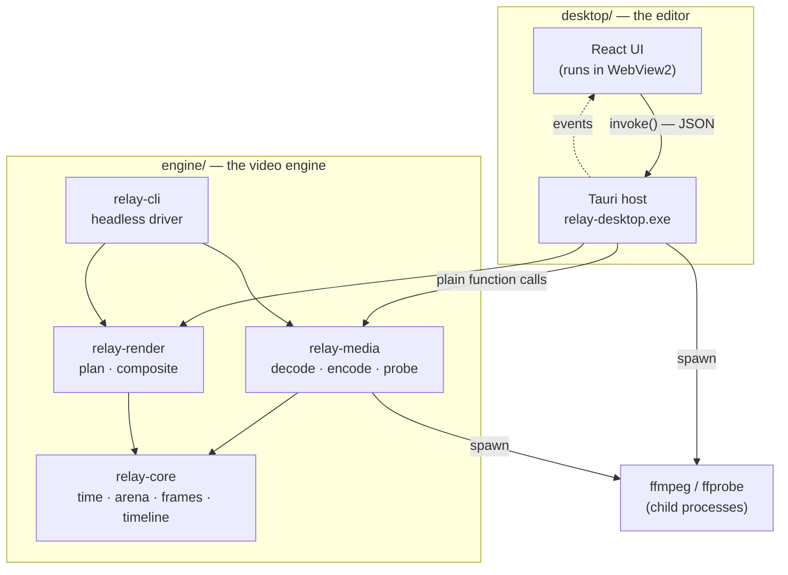
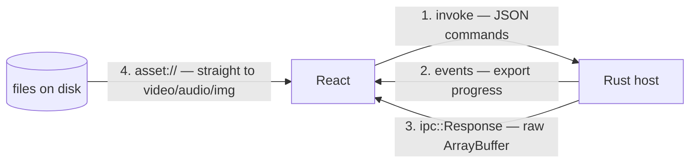
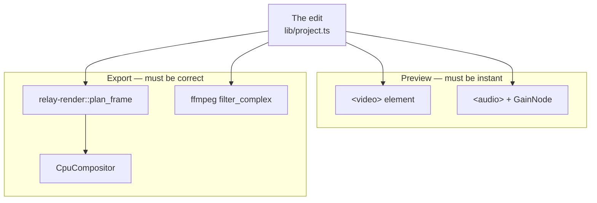
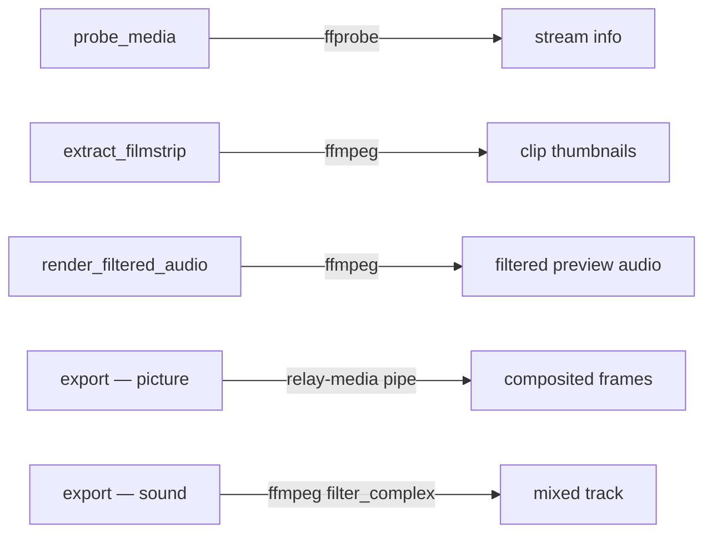
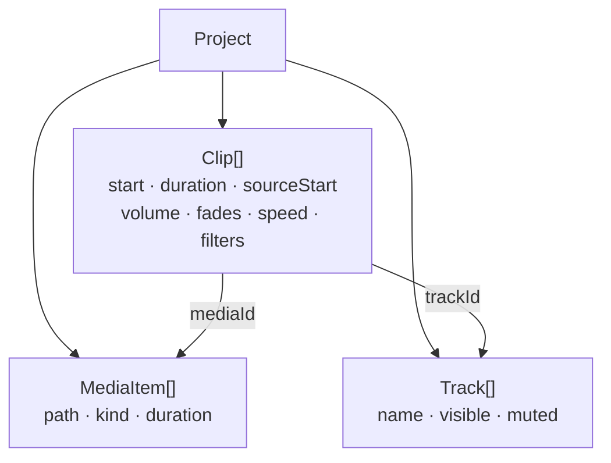
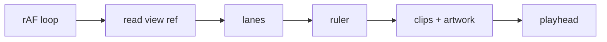
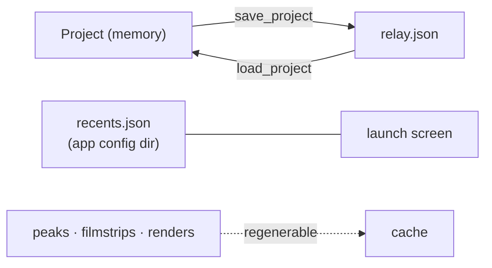

# How Relay works

A map of the whole system. For *why* particular choices were made, see the
decision logs in `engine/docs/decisions/` and `desktop/docs/decisions/`.

## The two halves



The engine has **no idea a UI exists**. It builds, tests and versions on its
own, `relay-cli` drives the identical code from a terminal, and every engine
test runs headless. That is why `desktop/` depends on `engine/` by path and
never the reverse.

`relay-core` has **zero dependencies** — std only. It is the vocabulary
everything else speaks, so a dependency there is a dependency everywhere.

## The bridge

There is no IPC between the host and the engine — they are one process, and
calls are ordinary Rust. The only boundary is between the webview and the host,
and it carries four different kinds of traffic for four different reasons.



1. **Commands** — `probe_media`, `export_project`, `save_project`… Every one
   goes through `src/lib/engine.ts`; nothing else in the app calls `invoke`, so
   a signature change has exactly one place to fix.
2. **Events** — export runs on a blocking thread and emits `export://progress`.
   A two-minute render that says nothing is indistinguishable from a hang.
3. **Raw bytes** — filmstrips, audio, filtered renders. A few megabytes as a
   JSON array of numbers would be unusable.
4. **The asset protocol** — media files load straight into `<video>`/`<audio>`
   without touching Rust. Preview playback is not bottlenecked on the bridge.

## Two paths through everything

This is the single most important thing to understand. **Preview and export are
different code paths**, and they are allowed to be — but only where they
cannot disagree about the *result*.



| | Preview | Export |
|---|---|---|
| Picture | one `<video>`, top clip only | full multi-track composite |
| Sound | media elements + gain nodes | ffmpeg `filter_complex` mix |
| Compositing | **none** | real |
| Clock | browser `requestAnimationFrame` | frame counter |

The preview deliberately cannot composite. Two stacked clips show only the
upper one. That is a known limit, not a bug — see
`desktop/docs/decisions/0004`.

**Where they must agree, there is only one source of truth.** Clip gain, fades,
speed and filters are *numbers on the clip*, and both paths read the same
numbers. Audio filters go further: `lib/filters.ts` produces one FFmpeg filter
string, and the preview plays a render produced by that exact string. There is
no second implementation to drift.

## FFmpeg, in five places



All five spawn FFmpeg as a **child process** rather than linking it. The
reasoning, its real costs, and the exit criteria are in
`engine/docs/decisions/0002-ffmpeg-over-a-pipe.md`.

Short version: a pipe carries no presentation timestamps and cannot seek to an
exact frame. Those are correctness limits, not performance ones, and they are
why a linked decoder exists —

### The FFI decoder (built, tested, **not yet used**)

`relay-media`'s optional `ffi` feature builds `FfiDecoder`, which links
libav\* directly and provides the two things the pipe cannot:

- `position()` — the real presentation timestamp, as an exact rational
- `seek()` — frame-accurate, via keyframe-seek plus decode-forward

It is off by default and nothing in the app enables it. It exists so that
playback can be rewritten onto it; until then the subprocess path is what runs.

The seam that made this cheap: `FrameSource` is the trait both implement, and
`SeekableSource` is deliberately *separate* so the pipe cannot pretend to offer
seeking it does not have.

## The edit model



Tracks are **untyped** — any media on any lane. A clip knows what it is; a
track does not need to. Track order is bottom-first, matching the engine's
compositing order, and the timeline draws it reversed.

Every operation is a pure function `(project, args) => project`. That is the
shape a command sent to the engine will have, so the call sites survive the
migration when the engine takes ownership of the model.

**This model is provisional.** `relay-core` already has a better version of
these types — exact rational time, generational arena handles. The UI holds it
only because the engine has no project *API* yet.

## Time

The engine works in **exact rationals**, never floats:

```
29.97 fps  →  Rational(30000, 1001)     not 29.97
frame 1800 →  Rational(60060, 1000)     exactly 60.06s
```

An `f64` accumulator drifts — add `1/29.97` for an hour and you are visibly
off. `relay-core::time` is tested against exactly this: 107,892 accumulated
frame durations still land on the right frame.

The UI works in `f64` seconds, which is a real downgrade, and is acceptable
only because nothing there is authoritative. **The conversion happens at the
Rust boundary**, where `export.rs` quantises every value onto the frame grid.

## Rendering the timeline

The timeline is one `<canvas>` with a single `requestAnimationFrame` loop.
A real edit is thousands of clips and keyframes; as DOM nodes that is thousands
of elements restyled on every scrub, and layout — not React — is the wall.



The loop reads props through a ref, so a prop change never tears it down. Clip
artwork — waveforms and filmstrips — lives in a plain `Map` that the loop reads
directly, so artwork arriving costs **no React render**.

Canvas cannot resolve `var(--color-x)`, so the palette is copied out of the
stylesheet whenever the theme changes.

## Persistence



- **`relay.json`** lives in the project folder and holds the whole edit. Written
  to a temp file and renamed into place, because a half-written save is worse
  than no save.
- **`recents.json`** lives in the *app config* directory, not in any project —
  copying a project to another machine should not drag your history along.
- **Caches** are derived data and belong nowhere near either.

## Layout of the repository

```
engine/
  crates/relay-core     time, arena, frames, timeline model   (no deps)
  crates/relay-media    probe, decode, encode, optional FFI
  crates/relay-render   frame plan, CPU compositor
  crates/relay-cli      headless driver
  docs/decisions/       why the engine is the way it is

desktop/
  src/App.tsx           shell, window state, keyboard map
  src/components/       panels, timeline canvas, chrome
  src/lib/engine.ts     the ONLY file that calls invoke()
  src/lib/project.ts    the provisional edit model
  src/lib/filters.ts    filter catalogue → ffmpeg strings
  src/lib/audio.ts      preview playback and gain
  src-tauri/src/        commands, export pipeline, project files
  docs/decisions/       why the app is the way it is

vendor/                 FFmpeg dev build for the FFI feature (gitignored)
BUILD.md                how to build it
```

## Rules worth keeping

1. **`lib/engine.ts` is the only file that calls `invoke`.**
2. **The engine never learns about the UI.** If a command starts making
   decisions about the edit, that logic belongs in `relay-core`.
3. **No time arithmetic in TypeScript.** `lib/time.ts` formats; it does not
   compute.
4. **The timeline is not DOM.**
5. **One source of truth per behaviour.** Where preview and export must agree,
   they read the same numbers or run the same string.
