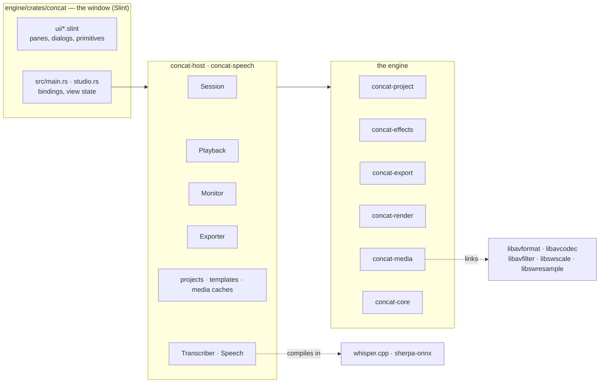
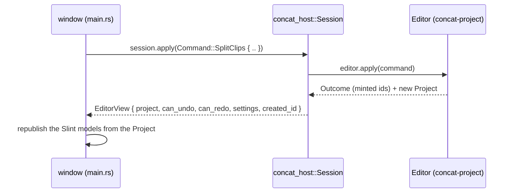
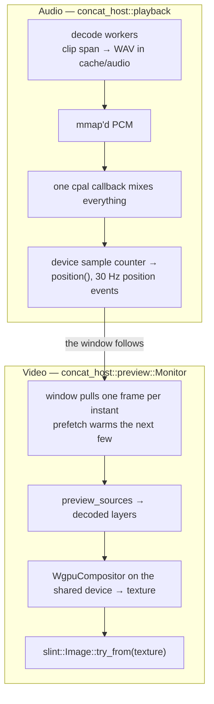

# Concat Architecture

A study map of the system as it stands in September 2026: what each layer
owns, how they talk, where the sharp edges are, and what deserves attention
next. File references are current as of this writing.

---

## 1. The shape of it, and the one rule



**The rule (engine doctrine):** everything important lives in the engine
crates. The window renders state and issues commands; the host layer is
plumbing between the two. The engine owns the project model, the undo
history, the render path, the document format, and the codecs. When a
feature is being designed, the first question is "which engine crate does
this belong to".

There is no wire, no JSON boundary, no second language: the window calls
Rust functions in-process. The rule therefore has nothing to enforce it but
discipline, and the risk is that editing logic leaks into the window without
anyone noticing. The test for a change is whether it could be driven from
`concat-cli` without a window; if not, it is in the wrong place.

The dependency arrows point one way:

```
concat (window) → concat-speech → concat-host → {export, project, media} → core
                                              → render → core
                                                 export → effects → project
```

`concat-core` depends on nothing. `concat-project` knows nothing about
rendering. `concat-media` is the only crate that knows FFmpeg exists.
`concat-effects` knows what an effect *is* (its manifest and its template)
and nothing about running one; the decoder runs FFmpeg chains and the
compositor will run shaders.

| Crate | Lines | Tests | Owns |
|---|---|---|---|
| `concat-core` | 1.6k | 31 | Rational time, frame model, arena handles, timeline model. Zero dependencies. |
| `concat-media` | 3.4k | 39 | Linked FFmpeg: probe, video decode with filter graphs and frame pacing, audio decode through a graph, H.264 encode, AAC mixing through libavfilter, muxing, waveform peaks, the reader pool with its byte-budgeted frame cache, JPEG stills. |
| `concat-project` | 3.3k | 41 | The document: model, every edit command, undo `Editor`, `concat.json` round-trip. |
| `concat-render` | 1.3k | 28 | Compositing. `CpuCompositor` is the reference; `WgpuCompositor` behind `gpu`. |
| `concat-effects` | 1.1k | 22 | Effect packages: the manifest format, the chain-template expression language, the catalogue. Every built-in effect is a folder under `packages/`, compiled in; user packages load from a directory. |
| `concat-export` | 2.3k | 6 | Timeline → file: flatten, the frame-by-frame render loop, the paused monitor's true frame. Chains come from `concat-effects`. |
| `concat-host` | 3.4k | 22 | Sessions, project folders and recents, media caches beside the project, the monitor's reader pool, the export slot, audio playback, templates, one-at-a-time job slots, app directories. |
| `concat-speech` | 1.2k | 6 | Transcription (whisper.cpp in-process) and text to speech (Kokoro via sherpa-onnx), with model downloads. |
| `concat-cli` | 0.2k | 3 | Probe/render vertical slice for testing the engine without the app. |
| `concat` | 4.5k Rust + 14.9k Slint | 3 | The window. Every pane, dialog and primitive, bound to the host layer: sessions, imports, gestures as commands, the monitor, playback, export, speech. |

---

## 2. The edit loop

The engine owns the project; the window never keeps a model of its own. Every
edit round-trips as a function call:



Key properties:

- **One session, one thread.** `Session` is a plain struct owned by the
  window's event-loop thread. There is no mutex around the edit because there
  is no second caller; long work (saves, probes, renders, decodes) takes what
  it needs *out* of the session first and runs on its own thread.
- **Gestures commit once.** A drag must not send a command per pixel. The
  window previews a gesture on an echo (a clone of the project the pointer
  mutates) and commits one command on release, so undo undoes the drag.
  That is the `Gesture` state machine in `studio.rs`.
- **Undo lives in the engine** - a bounded history of full `Project` clones
  (depth 200), not command inversion.
- **Saving is one code path.** `Session::prepare_save` hands back the folder
  and the document; `projects::save` writes to a temporary file and renames,
  so a crash mid-save cannot truncate the project.
- **The document format is frozen by the documents that exist.** Projects
  saved as `wolfcut.json` still open; new ones are written as `concat.json`,
  with the version key the app's current name. The reader never looks at
  that key.

---

## 3. Media

`concat-media` links the FFmpeg libraries and calls them directly. What that
gives, and what it costs:

- **Every frame carries its real presentation timestamp**, so variable
  frame-rate material stays in sync with the timeline.
- **Seeks are frame-accurate**: the container lands on the keyframe before
  the target and the decoder discards up to it. The reader pool's "roll
  forward or seek" policy is guided by timestamps rather than by counting
  frames ordinally.
- **Rotation is honoured**: portrait phone footage is turned the way every
  player turns it, by reading the display matrix off the codec parameters
  (where FFmpeg 7 keeps it) and inserting the same `transpose`/`hflip,vflip`
  FFmpeg's own autorotate would.
- **A build needs the FFmpeg development libraries.** `ffmpeg-the-third`
  binds them at build time with bindgen, so a build machine needs headers,
  import libraries and libclang. Homebrew serves on macOS; Windows and older
  Linux distributions use a BtbN `shared` build via `FFMPEG_DIR`. The price
  is paid in CI configuration, not in code.

### 3.1 The video decoder

`decode::Decoder` does everything in one place:

```
container seek (keyframe) → discard frames before `start`
  → [pacer: pick the source frame on screen at the next output instant]
  → libavfilter graph: [rotate] → scale → [effect chain → guard scale] → format=rgba
  → copy rows out of the padded buffer into a Frame
```

The graph is built lazily from the first decoded frame's real format and
size, and rebuilt if a later frame differs. The clip's effect chain is a
plain FFmpeg filter string, exactly the string the export mix uses for
audio, validated so it cannot escape its slot. Pacing (`at_rate`) duplicates
and drops source frames so exactly one comes out per output instant; without
it the decoder yields every source frame with its timestamp, which is what
the reader pool wants. `looping` repeats the last frame forever, which is how
a still image behaves like footage.

### 3.2 The audio decoder

`samples::AudioDecoder` is the one door for sound-as-numbers. Callers say
what window of the file they want, which filters to run it through, and the
rate, layout and format they want back; libavfilter's `atrim`, the filters,
`aresample` and `aformat` do the rest in one graph. Three callers, three
shapes:

| Caller | Rate | Layout | Format | Filters |
|---|---|---|---|---|
| waveform peaks | 48 kHz | mono | s16 | none |
| playback cache | 48 kHz | stereo | s16 | speed stages + the clip's chain |
| transcription | 16 kHz | mono | f32 | none |

Because the playback cache and the export mix run the clip's speed and chain
through the same filter strings, what the preview mixes is what the export
renders.

### 3.3 Encode, mix, mux

- `encode::Encoder` is libx264 through libavcodec, RGBA → yuv420p through
  libswscale, into an MP4 with `+faststart`. `encode::jpeg` is the same
  machinery with the MJPEG encoder, for posters.
- `audio::mix_to_file` parses the `filter_complex` string the pure,
  unit-tested `audio::mix_graph` planner produces into a libavfilter graph
  with one `abuffer` per clip bound to the `[N:a]` labels, an `aformat`
  landing on the AAC encoder's format, and an `abuffersink` sized to the
  encoder's frame. Inputs are fed round-robin and the sink drained after
  every push, so no input runs ahead by more than a frame.
- `audio::mux` copies the encoded streams into the final container,
  stopping at the shorter one.

### 3.4 The reader pool

One warm decoder per (file, size, chain), a byte-budgeted LRU of decoded
frames in front, "roll forward if the target is close ahead, seek
otherwise". Export does not use it: export decodes every frame exactly once
in order, and a cache in that path is pure overhead.

---

## 4. Preview and playback: two clocks, one truth



- **The audio device is the only clock.** `Playback::position()` reads the
  mix callback's sample counter; `PlaybackEvents::position` pushes it at
  30 Hz while playing. Video chases audio, never the other way around.
- **The monitor shows the engine's real composited frame** - the same pixels
  the exporter would produce - at a preview size the window chooses.
- **One GPU device, shared.** The window creates a wgpu device (`gpu.rs`)
  and hands it to Slint's renderer and to the monitor's compositor. A
  preview frame is decoded, uploaded once per layer, composited on that
  device into a presentable texture, and shown by Slint as that texture:
  nothing is read back and nothing is copied. Without an adapter the
  monitor composites on the CPU and the window uploads the pixels.
- **Nothing here knows about a window.** `Playback` reports through a trait
  object; `Monitor` returns bytes. The window decides which thread runs what,
  and hands results back to the Slint event loop with
  `slint::invoke_from_event_loop`. That seam is where the wiring in §7 goes.

---

## 5. Export

Hybrid pipeline in `concat-export`:

- **Picture:** flattened timeline → per-frame composition in-process (CPU or
  wgpu) → the linked H.264 encoder.
- **Audio:** one filtergraph mixes every audible clip in a single pass.
- **Transitions are lowered before either path runs** - a cross-fade becomes
  overlapping clips with opacity ramps and fade filters - so the compositor
  never knows transitions exist.
- The host's `export::request` flattens the open session and adds the
  destination and quality; `export::run` reports progress through a callback
  and stops on a flag; `Exporter` is the one-at-a-time slot.

---

## 6. Speech

- **Transcription** loads a ggml Whisper model through `whisper-rs`, keeps it
  loaded until another is asked for, feeds it 16 kHz mono floats straight
  from `AudioDecoder`, and reads segments back in centiseconds. On macOS the
  Metal build runs the encoder on the GPU. Cancellation is whisper's abort
  callback reading the job's flag.
- **Text to speech** is Kokoro through sherpa-onnx's official bindings,
  statically linked from prebuilt libraries the sys crate downloads at build
  time. Narration lands as a WAV in the project's `audio/` folder - not
  `cache/`, because a clip on the timeline points at it.
- Both download models on demand into the app's data directory
  (`app.concat.editor` under the platform's application-support folder) and
  refuse a second concurrent run through `SingleFlight`.

---

## 7. The window

`engine/crates/concat` is 14.9k lines of `.slint` across the workspace
(dockable seats holding four views), the timeline (lanes, tabs, track
headers, tray), the inspector, the media bin, the launch screen, the export
and settings sheets, menus, tooltips, toasts, and the primitives under them.
Fonts and effect previews are embedded in the binary.

The Rust side is small and split by what it owns:

| File | Owns |
|---|---|
| `lib.rs` | Startup (the backend, the services), and one binding per callback the `Editor` global exposes. Every handler is "mutate the state, then republish". `main.rs` is the desktop's and iOS's call into it; `concat-android` is Android's. |
| `platform.rs` | The three things a phone does differently from a desk: how the backend is chosen, how a file or folder is picked, whether the title strip is dragged. Everything else is shared. |
| `studio.rs` | The window's state. Reads the engine's `Project` through the open `Session`; writes every edit as a `Command`. Holds what the document does not: selection, playhead, zoom, tool, which lanes are locked, the dock tree, what the sheets show. Publishes it all into Slint's models. |
| `host.rs` | The engine's services (playback, monitor, exporter, transcriber, speech, app directories) and the bridge from worker threads back to the event loop. |
| `dock.rs` | The workspace's arrangement as a tree, walked flat for Slint. |
| `chips.rs` · `format.rs` · `prefs.rs` · `sysinfo.rs` | Drag chips, formatting and the waveform path, remembered preferences, the About block. |

Two mechanisms carry the whole design:

- **The echo.** A press clones the project; the pointer mutates the clone;
  `publish` draws whichever exists; release turns the difference into one
  `MoveClips` or `TrimClip`. The inspector's knobs do the same and commit
  as one batch. Undo therefore undoes the gesture, never a pixel of it.
- **`spawn` and `Shell::with`.** Anything slow runs on its own thread and
  hands its result to `slint::invoke_from_event_loop`, where the state is
  reached again through a thread-local. Nothing but the event-loop thread
  ever touches the state, which is why it needs no lock.

---

## 8. Sharp edges and the work plan

Ordered by how much each matters. Every item is a trap for a contributor who
does not know the invariant, or a piece of work with a known shape.

### 8.1 Put a real project through every flow in the window

Every flow in §7 needs a real project put through it, and the window has no
tests of its own. Known items: the clip context menu's actions did not take
effect in one report; timeline clips draw no filmstrip (audio clips draw
their waveform, and `lanes.slint` has the slot); the monitor's failures log
to stderr and toast once. The durable fix is a headless harness that drives
`Studio` against a `Session` without a window and snapshots what it
publishes, so this class of bug is caught by a test.

### 8.2 Title clips need a rasteriser in the engine

`ExportRequest` takes rasterised titles as image clips, and nothing in the
tree draws text into a `Frame`. The work is a text rasteriser (a
`cosmic-text`/`fontdue`-shaped crate against the embedded Inter and Synonym
faces) in the engine, so titles render identically in the monitor and the
export.

### 8.3 Fades count output frames

`Decoder` runs a clip's chain on each *paced* output frame, so a `fade` in a
chain counts output frames - which is what `resolve_transitions` assumes when
it computes `nb_frames` at the output rate. Compare an exported dissolve
frame for frame against an `ffmpeg` command-line render of the same graph
before trusting it.

### 8.4 Lock discipline in `playback.rs`

28 `unwrap`/`expect` sites across four kinds of threads (mix callback,
transport, decode workers, cache sweep). One panic in a decode worker poisons
a mutex and cascades. Pick one poison policy (probably: clear the poisoned
state and carry on, since every cache here is rebuildable) and apply it once.

### 8.5 Unbounded growth

- `redo: Vec<Project>` in `concat-project`'s editor has **no cap** (undo is
  capped at 200); each entry is a deep clone of the whole project.
- The reader pool's cache is bounded; the window's image cache for filmstrips
  needs a bound too, or a long session accumulates textures. Filmstrips are
  raw RGBA `Frame`s with no disk cache; posters are cached as JPEG.

### 8.6 The mix has no end-to-end test

`mix_graph` is pinned by a dozen unit tests, and the export loop has tests
that render synthetic video; `mix_to_file` and `mux` are exercised by no
test with real audio. Write one against a generated tone before anything
else touches the audio path.

### 8.7 Build environment

- FFmpeg 7 is the floor (the display matrix lives in `coded_side_data` from
  7.0; the code reads it there). Ubuntu 24.04 ships 6.1, hence the BtbN
  download in CI. A contributor with a distribution FFmpeg older than 7 gets
  a compile error deep in the bindings, not a message.
- `whisper-rs-sys` builds whisper.cpp with cmake at build time; `sherpa-onnx-
  sys` downloads prebuilt static libraries at build time. A clean build needs
  the network twice (three times counting `skia-bindings`) and several
  minutes. The workspace lock resolves 746 crates.
- The workflows (`ci.yml`, `build-app.yml`, `release.yml`) have to be run
  green on all three platforms. Windows (libclang via chocolatey,
  `FFMPEG_DIR`, MSVC for whisper.cpp) is the one to watch.

### 8.8 Phones

The window builds and packages for Android and iOS (`mobile.yml`, the
`scripts/*-mobile.sh` trio, `concat-android`), and what runs there is the
desktop's tree on a phone's screen. The next work, in order:

- A phone layout. The dock, the inspector and the timeline assume a wide
  window and a pointer; a phone wants one seat at a time, touch-sized
  targets, and the timeline under the monitor. The `.slint` tree can carry
  a second arrangement chosen by the window's size.
- Picking files. `platform.rs` returns nothing for a pick on a phone; the
  system document picker (Storage Access Framework, `UIDocumentPicker`)
  has to hand the window a readable path or a file descriptor, and
  `concat-media` opens by path today.
- Hardware codecs are linked, not yet asked for: `concat-media` opens the
  software decoder by name. MediaCodec also needs `av_jni_set_java_vm`
  from the activity before FFmpeg can reach it.
- The monitor on Android composites on the CPU: Slint's android-activity
  backend creates its own wgpu device and there is no way to hand it ours,
  so the shared-texture path in `gpu.rs` is desktop and iOS only.
- The iOS build is exercised only in CI, on a runner with Xcode.
- Three build-script quirks are papered over in `scripts/mobile-env.sh`
  rather than fixed upstream: whisper-rs-sys names `ggml-blas` whenever
  the *host* is a Mac, Slint's Android backend reads the NDK API level as
  the SDK platform, and cargo-apk does not pass bindgen the NDK sysroot.

### 8.9 DTO shapes in the export path

`ExportClip`, `ExportRequest` and `PreviewFrameRequest` are JSON-shaped
DTOs. `concat-export` could take the engine's `Project` and settings
directly and drop the flattening-through-a-DTO; the `serde` derives on the
host's view types go with them.

### 8.10 Panics in runtime paths

Engine `.expect()`s exist in `decode.rs`, `encode.rs`, `pool.rs` and
`time.rs` ("rational overflowed i64"). Most are genuine invariants
("the graph has an input" right after building it); each is a crash-not-error
if wrong. The host's `templates.rs` and `media.rs` counts are dominated by
tests, which is fine.

### 8.11 Housekeeping

- **Zero TODO/FIXME/HACK comments** in the tree. Invariants live in prose
  comments instead; keep it that way.
- `cargo fmt --check` runs in CI; keep it clean.

---

## 9. Test coverage map

| Area | Tests | Gaps |
|---|---|---|
| Engine crates | 170 (core 31, media 39, project 41, render 28, effects 22, export 6, cli 3) | `mix_to_file`/`mux` untested end to end (§8.6); `gpu` feature untested at defaults |
| Host | 22 | `Playback` (threads, cpal) has unit tests only for the WAV walk and the sweep; no test drives the decode workers |
| Speech | 6 | Model downloads and whisper itself are network- and model-bound; test with `tiny.en` behind an opt-in feature |
| Window | 3 | Formatting helpers only. Drive `Studio` against a `Session` from a headless harness and snapshot what it publishes |

The real-media tests generate their own fixtures with the linked encoder
(a 90-frame colour ramp, a 60-frame strip) so they run anywhere the engine
builds. There is no corpus of real-world files; portrait phone footage,
variable frame rate, and odd containers are the cases most likely to bite.

---

## 10. Where to improve first (opinionated)

1. **Put a real project through every flow in the window** (§8.1) and fix
   what breaks; then filmstrips on the lanes.
2. **A tone-based mix test** (§8.6) before touching the audio path again.
3. **A text rasteriser in the engine** (§8.2) - the one feature the Rust
   tree cannot express today.
4. **One poison policy** in `playback.rs` (§8.4) - mechanical, removes the
   cascade failure mode.
5. **Cap the redo stack** (§8.5) - a small patch, a real leak.
6. **Green CI on all three platforms** (§8.7), then package the window and
   restore automatic alpha releases.
7. **Frame-for-frame compare an exported dissolve** against an `ffmpeg`
   command-line render (§8.3).
