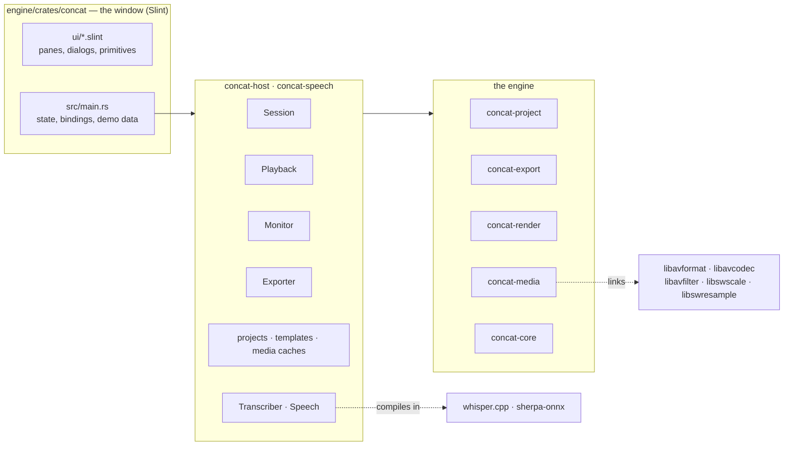
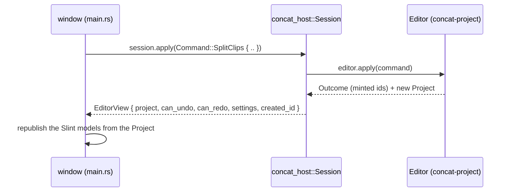
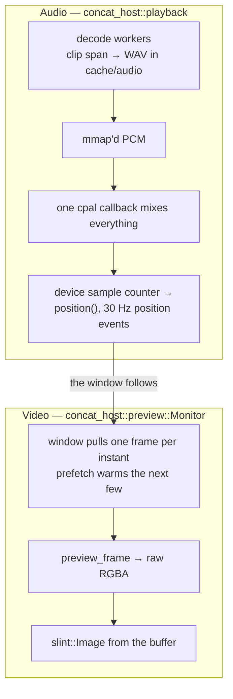

# Concat Architecture

A study map of the system as it stands in September 2026, written just after
two large moves: the user interface left Tauri + React for Slint, and the
engine stopped spawning `ffmpeg`, `ffprobe` and `whisper-cli` in favour of
linking FFmpeg and compiling whisper.cpp in. What each layer owns, how they
talk, where the sharp edges are, and what deserves attention next. File
references are current as of this writing.

---

## 1. The shape of it, and the one rule



**The rule (engine doctrine):** everything important lives in the engine
crates. The window renders state and issues commands; the host layer is
plumbing between the two. The engine owns the project model, the undo
history, the render path, the document format, and now the codecs. When a
feature is being designed, the first question is still "which engine crate
does this belong to".

What changed since the Tauri days is that the rule no longer has to survive a
wire. There is no IPC, no JSON boundary, no second language: the window calls
Rust functions in-process. Two of the previous architecture's largest debts -
the hand-maintained TypeScript mirror of the FFmpeg filter catalogue, and the
UI re-deriving "what is on screen" in parallel with the engine's flattener -
ceased to exist with the language they were written in. The remaining risk is
the opposite one: with no boundary, editing logic can leak into the window
without anyone noticing. The test for a change is whether it could be driven
from `concat-cli` without a window; if not, it is in the wrong place.

The dependency arrows point one way:

```
concat (window) → concat-speech → concat-host → {export, project, media} → core
                                              → render → core
```

`concat-core` depends on nothing. `concat-project` knows nothing about
rendering. `concat-media` is the only crate that knows FFmpeg exists.

| Crate | Lines | Tests | Owns |
|---|---|---|---|
| `concat-core` | 1.6k | 31 | Rational time, frame model, arena handles, timeline model. Zero dependencies. |
| `concat-media` | 3.4k | 39 | Linked FFmpeg: probe, video decode with filter graphs and frame pacing, audio decode through a graph, H.264 encode, AAC mixing through libavfilter, muxing, waveform peaks, the reader pool with its byte-budgeted frame cache, JPEG stills. |
| `concat-project` | 3.3k | 41 | The document: model, every edit command, undo `Editor`, `concat.json` round-trip. |
| `concat-render` | 1.3k | 28 | Compositing. `CpuCompositor` is the reference; `WgpuCompositor` behind `gpu`. |
| `concat-export` | 2.5k | 32 | Timeline → file: flatten, filtergraph builders (`chains.rs`), the frame-by-frame render loop, the paused monitor's true frame. |
| `concat-host` | 3.4k | 22 | Sessions, project folders and recents, media caches beside the project, the monitor's reader pool, the export slot, audio playback, templates, one-at-a-time job slots, app directories. |
| `concat-speech` | 1.2k | 6 | Transcription (whisper.cpp in-process) and text to speech (Kokoro via sherpa-onnx), with model downloads. |
| `concat-cli` | 0.2k | 3 | Probe/render vertical slice for testing the engine without the app. |
| `concat` | 5.0k Rust + 14.9k Slint | 0 | The window. Every pane, dialog and primitive, and - today - a demo model that stands in for the engine. |

---

## 2. The edit loop

The engine owns the project; the window never keeps a model of its own. Every
edit round-trips, now as a function call:



Key properties, unchanged in substance from the Tauri architecture:

- **One session, one thread.** `Session` is a plain struct owned by the
  window's event-loop thread. There is no mutex around the edit because there
  is no second caller; long work (saves, probes, renders, decodes) takes what
  it needs *out* of the session first and runs on its own thread.
- **Gestures commit once.** A drag must not send a command per pixel. The
  Tauri UI previewed gestures locally ("echo") and committed one command on
  release, so undo undoes the drag. The Slint window's demo model does the
  same thing in its `Gesture` state machine; that shape survives the wiring.
- **Undo lives in the engine** - a bounded history of full `Project` clones
  (depth 200), not command inversion.
- **Saving is one code path.** `Session::prepare_save` hands back the folder
  and the document; `projects::save` writes to a temporary file and renames,
  so a crash mid-save cannot truncate the project.
- **The document format is frozen by the documents that exist.** Projects
  saved as `wolfcut.json` still open; new ones are written as `concat.json`,
  with the version key the app's current name. The reader never looks at
  that key.

---

## 3. Media: linked, not spawned

`concat-media` used to pipe raw RGBA out of an `ffmpeg` child process and
parse `ffprobe`'s JSON. It now calls the libraries. What that bought, and
what it cost:

- **Every frame carries its real presentation timestamp**, so variable
  frame-rate material no longer drifts through a pipe that had no
  timestamps at all.
- **Seeks are frame-accurate**: the container lands on the keyframe before
  the target and the decoder discards up to it. The reader pool's "roll
  forward or seek" policy is now guided by timestamps rather than by counting
  frames ordinally.
- **Rotation is honoured**: portrait phone footage is turned the way every
  player turns it, by reading the display matrix off the codec parameters
  (where FFmpeg 7 moved it) and inserting the same `transpose`/`hflip,vflip`
  ffmpeg's own autorotate would.
- **A build needs the FFmpeg development libraries.** `ffmpeg-the-third`
  binds them at build time with bindgen, so a build machine needs headers,
  import libraries and libclang. Homebrew serves on macOS; Windows and older
  Linux distributions use a BtbN `shared` build via `FFMPEG_DIR`. This is the
  price of the move and it is paid in CI configuration, not in code.

### 3.1 The video decoder

`decode::Decoder` does in one place what the subprocess did with flags:

```
container seek (keyframe) → discard frames before `start`
  → [pacer: pick the source frame on screen at the next output instant]
  → libavfilter graph: [rotate] → scale → [effect chain → guard scale] → format=rgba
  → copy rows out of the padded buffer into a Frame
```

The graph is built lazily from the first decoded frame's real format and
size, and rebuilt if a later frame differs. The clip's effect chain is a
plain FFmpeg filter string, exactly the string the export mix uses for
audio, validated so it cannot escape its slot. Pacing (`at_rate`) duplicates
and drops source frames so exactly one comes out per output instant; without
it the decoder yields every source frame with its timestamp, which is what
the reader pool wants. `looping` repeats the last frame forever, which is how
a still image behaves like footage.

### 3.2 The audio decoder

`samples::AudioDecoder` is the one door for sound-as-numbers. Callers say
what window of the file they want, which filters to run it through, and the
rate, layout and format they want back; libavfilter's `atrim`, the filters,
`aresample` and `aformat` do the rest in one graph. Three callers, three
shapes:

| Caller | Rate | Layout | Format | Filters |
|---|---|---|---|---|
| waveform peaks | 48 kHz | mono | s16 | none |
| playback cache | 48 kHz | stereo | s16 | speed stages + the clip's chain |
| transcription | 16 kHz | mono | f32 | none |

Because the playback cache and the export mix run the clip's speed and chain
through the same filter strings, what the preview mixes is what the export
renders.

### 3.3 Encode, mix, mux

- `encode::Encoder` is libx264 through libavcodec, RGBA → yuv420p through
  libswscale, into an MP4 with `+faststart`. `encode::jpeg` is the same
  machinery with the MJPEG encoder, for posters.
- `audio::mix_to_file` parses the same `filter_complex` string
  `audio::mix_graph` always produced - the pure, unit-tested planner is
  untouched - into a libavfilter graph with one `abuffer` per clip bound to
  the `[N:a]` labels, an `aformat` landing on the AAC encoder's format, and
  an `abuffersink` sized to the encoder's frame. Inputs are fed round-robin
  and the sink drained after every push, so no input runs ahead by more than
  a frame.
- `audio::mux` copies the encoded streams into the final container,
  stopping at the shorter one.

### 3.4 The reader pool

Unchanged in purpose: one warm decoder per (file, size, chain), a
byte-budgeted LRU of decoded frames in front, "roll forward if the target is
close ahead, seek otherwise". The two backends it used to switch between
(linked when available, pipe otherwise) collapsed into one.

---

## 4. Preview and playback: two clocks, one truth



- **The audio device is the only clock.** `Playback::position()` reads the
  mix callback's sample counter; `PlaybackEvents::position` pushes it at
  30 Hz while playing. Video chases audio, never the other way around.
- **The monitor shows the engine's real composited frame** - the same pixels
  the exporter would produce - at a preview size the window chooses.
- **Nothing here knows about a window.** `Playback` reports through a trait
  object; `Monitor` returns bytes. The window decides which thread runs what,
  and hands results back to the Slint event loop with
  `slint::invoke_from_event_loop`. That seam is where the wiring in §7 goes.

---

## 5. Export

Hybrid pipeline in `concat-export`, unchanged in shape:

- **Picture:** flattened timeline → per-frame composition in-process (CPU or
  wgpu) → the linked H.264 encoder.
- **Audio:** one filtergraph mixes every audible clip in a single pass.
- **Transitions are lowered before either path runs** - a cross-fade becomes
  overlapping clips with opacity ramps and fade filters - so the compositor
  never knows transitions exist.
- The host's `export::request` flattens the open session and adds the
  destination and quality; `export::run` reports progress through a callback
  and stops on a flag; `Exporter` is the one-at-a-time slot.

---

## 6. Speech

- **Transcription** loads a ggml Whisper model through `whisper-rs`, keeps it
  loaded until another is asked for, feeds it 16 kHz mono floats straight
  from `AudioDecoder`, and reads segments back in centiseconds. On macOS the
  Metal build runs the encoder on the GPU. Cancellation is whisper's abort
  callback reading the job's flag.
- **Text to speech** is Kokoro through sherpa-onnx's official bindings,
  statically linked from prebuilt libraries the sys crate downloads at build
  time. Narration lands as a WAV in the project's `audio/` folder - not
  `cache/`, because a clip on the timeline points at it.
- Both download models on demand into the app's data directory
  (`app.concat.editor` under the platform's application-support folder) and
  refuse a second concurrent run through `SingleFlight`.

---

## 7. The window, and the wiring that is not done

`engine/crates/concat` is the Slint tree ported from the wc-ui-rnd research
repository: 14.9k lines of `.slint` across the workspace (dockable seats
holding four views), the timeline (lanes, tabs, track headers, tray), the
inspector, the media bin, the launch screen, the export and settings sheets,
menus, tooltips, toasts, and the primitives under them. Fonts and effect
previews are embedded in the binary. It builds under the workspace's edition
and lints and it runs.

What drives it today is `src/main.rs`: 5k lines binding every callback of
the `Editor` global to a **demo model** - `Studio`, `TimelineDoc`,
`ClipDoc`, `Library`, `ExportState`, `SettingsState` - with fake media,
synthetic waveforms and simulated downloads. That model exists so the UI
could be built and judged before the engine was attached. It is the thing to
replace, and replacing it is the single largest open item in the codebase.

The mapping is direct, which is why it was worth porting the window first:

| Demo state in `main.rs` | Becomes |
|---|---|
| `TimelineDoc` / `ClipDoc` / `TrackDoc` | `concat_project::Project` read through `Session::project()`; edits become `Command`s |
| `Library` (bin rows, counts, filter) | `Project::media` plus `concat_host::media::probe` on import |
| `wave_path` from a seeded synthesiser | `concat_host::media::peaks` → the same SVG path builder |
| the empty preview stage | `Monitor::frame` → `slint::Image` |
| `playing` / `playhead` ticked by a timer | `Playback` and its clock |
| `ExportState`'s simulated progress | `Exporter` + `export::run` on a thread, progress through `invoke_from_event_loop` |
| `demo_transcribers` / `demo_voices` | `Transcriber::status` / `Speech::status`, downloads with real progress |
| `StartState` / `demo_recents` | `projects::create` / `open` / `list` / `forget` |
| `Dock` layout, gestures, selection, tool, zoom | stay in the window: this is what the UI genuinely owns |

Recommended order, each step leaving a runnable app: projects and recents →
media import with real probes and peaks → the timeline reading `Project`
and writing `Command`s → the monitor → playback → export → speech →
templates. Threading pattern for all of it: `std::thread::spawn` the work,
`slint::invoke_from_event_loop` the result; never block the event loop on a
decoder.

---

## 8. Footguns and technical debt

The honest list, ordered by how much they matter. Nothing here is on fire,
but several are traps for a contributor who does not know the invariant.

### 8.1 The window is a demo (highest priority)

Everything in §7. Until the wiring lands, the app cannot open a real
project. The host and engine are complete enough to support every feature
the Tauri app had; the gap is entirely in `main.rs`.

### 8.2 Title clips have no rasteriser

The Tauri UI rasterised text clips to PNGs in the webview (`rasterize.ts`)
and shipped them into the export as image clips - `ExportRequest` still
expects titles that way. Nothing in the Rust tree draws text into a `Frame`.
This needs a text rasteriser (a `cosmic-text`/`fontdue`-shaped crate against
the embedded Inter and Synonym faces) in the engine, so titles render
identically in the monitor and the export. Until then, text clips are
timeline objects with no picture.

### 8.3 The decoder's pacing changed semantics slightly

The subprocess applied `-r` (output pacing) after `-vf` (the effect chain),
so a `fade` in a chain counted *source* frames. `Decoder` runs the chain on
each *paced* output frame, so fades count output frames - which is what
`resolve_transitions` assumes when it computes `nb_frames` at the output
rate, and arguably more correct. Nobody has yet compared an exported dissolve
frame-for-frame against the old build. Do that before trusting it.

### 8.4 Lock discipline in `playback.rs`

Carried over unchanged: 28 `unwrap`/`expect` sites across four kinds of
threads (mix callback, transport, decode workers, cache sweep). One panic in
a decode worker poisons a mutex and cascades. Pick one poison policy
(probably: clear the poisoned state and carry on, since every cache here is
rebuildable) and apply it once.

### 8.5 Unbounded growth

- `redo: Vec<Project>` in `concat-project`'s editor has **no cap** (undo is
  capped at 200); each entry is a deep clone of the whole project.
- The reader pool's cache is bounded; the window's own image cache (once
  wired) needs a bound too, or a long session of filmstrips accumulates
  textures. Filmstrips are now raw RGBA `Frame`s with no disk cache (the old
  JPEG cache went with the subprocess); posters are still cached as JPEG.

### 8.6 The mix has no end-to-end test

`mix_graph` is pinned by a dozen unit tests, and the export loop has tests
that render synthetic video; `mix_to_file` and `mux` are exercised by no
test with real audio. The old subprocess path was covered by
`desktop/src-tauri/tests/export_integration.rs`, which died with the host.
Write the replacement against a generated tone before anything else touches
the audio path.

### 8.7 Build-environment fragility

- FFmpeg 7 is the floor (the display matrix moved to `coded_side_data` in
  7.0; the code reads it there). Ubuntu 24.04 ships 6.1, hence the BtbN
  download in CI. A contributor with a distribution FFmpeg older than 7 gets
  a compile error deep in the bindings, not a message.
- `whisper-rs-sys` builds whisper.cpp with cmake at build time; `sherpa-onnx-
  sys` downloads prebuilt static libraries at build time. A clean build needs
  the network twice (three times counting `skia-bindings`) and several
  minutes. The workspace lock resolves 746 crates.
- The CI in `.github/workflows/build.yml` was rewritten for all of this and
  has not yet run green on all three platforms. Windows in particular
  (libclang via chocolatey, `FFMPEG_DIR`, MSVC for whisper.cpp) is untested.

### 8.8 Dead code still in the repository

- `desktop/` no longer builds: its host Rust moved into `concat-host` and
  `concat-speech`, the media API it used is gone, and the Tauri commands were
  its only reason to exist. It stays as a reference for UI behaviour until
  the Slint window reproduces it, then it should be deleted along with
  `scripts/generate-ipc-types.sh`, the `types` features of `concat-project`
  and `concat-export` (ts-rs exports for a TypeScript that no longer exists),
  and the `desktop/src/lib/...` references in `chains.rs`'s comments.
- `flake.nix` packages the Tauri app and therefore does not build either.
- `ExportClip`, `ExportRequest` and `PreviewFrameRequest` are wire types
  shaped for JSON; with no wire, `concat-export` could take the engine's
  `Project` and settings directly and drop the flattening-through-a-DTO.

### 8.9 Panics in runtime paths

Engine `.expect()`s exist in `decode.rs`, `encode.rs`, `pool.rs` and
`time.rs` ("rational overflowed i64"). Most are genuine invariants
("the graph has an input" right after building it); each is a crash-not-error
if wrong. The host's `templates.rs` and `media.rs` counts are dominated by
tests, which is fine.

### 8.10 Housekeeping

- **Zero TODO/FIXME/HACK comments** in the tree. Invariants live in prose
  comments instead; keep it that way.
- Comments in `concat/ui/*.slint` still cite `web/` (the React reference in
  the wc-ui-rnd repository) and `desktop/` (the Tauri app). They are history,
  not pointers; rewrite them as the files are touched.
- Code comments still cite `docs/decisions/…` paths deleted long ago. Either
  restore the records or strip the references.
- `cargo fmt --check` is not clean across the older crates and is not
  enforced in CI; the new crates are formatted. Decide whether to enforce it.

---

## 9. Test coverage map

| Area | Tests | Gaps |
|---|---|---|
| Engine crates | 174 (core 31, media 39, project 41, render 28, export 32, cli 3) | `mix_to_file`/`mux` untested end to end (§8.6); `gpu` feature untested at defaults |
| Host | 22 | `Playback` (threads, cpal) has unit tests only for the WAV walk and the sweep; no test drives the decode workers |
| Speech | 6 | Model downloads and whisper itself are network- and model-bound; test with `tiny.en` behind an opt-in feature |
| Window | 0 | Nothing yet; once wired, drive `Session` from a headless harness and snapshot the Slint models |

The real-media tests generate their own fixtures with the linked encoder
(a 90-frame colour ramp, a 60-frame strip) so they run anywhere the engine
builds. There is no corpus of real-world files; portrait phone footage,
variable frame rate, and odd containers are the cases most likely to bite.

---

## 10. Where to improve first (opinionated)

1. **Wire the window** (§7), in the order given, committing after each step.
2. **A tone-based mix test** (§8.6) before touching the audio path again.
3. **A text rasteriser in the engine** (§8.2) - the one feature the Rust
   tree cannot express today.
4. **Delete `desktop/`** and the ts-rs vestiges (§8.8) once the window covers
   its features; it is a liability every day it looks like code.
5. **One poison policy** in `playback.rs` (§8.4) - mechanical, removes the
   cascade failure mode.
6. **Cap the redo stack** (§8.5) - a small patch, a real leak.
7. **Green CI on all three platforms** (§8.7), then package the window and
   restore automatic alpha releases.
8. **Frame-for-frame compare an exported dissolve** against a build from
   before the FFI move (§8.3).
