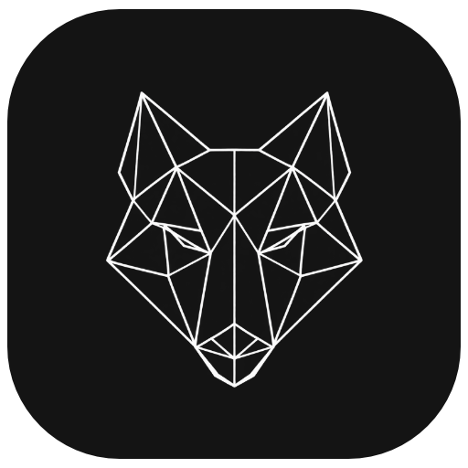

<div align="center">



# WolfCut

**A fast, lightweight desktop video editor.**

[](https://github.com/jub0t/WolfCut/actions/workflows/build.yml)
[](https://github.com/jub0t/WolfCut/releases)
[](engine)
[](desktop)
[](https://github.com/jub0t/WolfCut)

</div>

---

WolfCut is a desktop video editor that opens instantly and stays out of your
way. A native Rust engine does the heavy lifting, a clean React interface does
the editing, and FFmpeg ships inside the app — install it and start cutting,
no extra downloads, no setup.

## ✨ Highlights

- 🎬 **Multi-track timeline** — cut, trim, split, and arrange video, audio, and text
- ⚡ **Native performance** — a Rust engine under the hood, not a browser pretending
- 📦 **Batteries included** — bundles its own FFmpeg, works on a fresh machine
- 🪶 **Lightweight** — a few megabytes, opens in a blink
- 🖥️ **macOS & Windows** — one editor, both platforms

## 🚀 Get started

Grab a build from [Releases](https://github.com/jub0t/WolfCut/releases), or
build it yourself — [BUILD.md](BUILD.md) has everything, and it boils down to:

```sh
cd desktop
npm install
npm run app
```

Curious how it works inside? [ARCHITECTURE.md](ARCHITECTURE.md) is the tour.

## 📈 Growth

<a href="https://star-history.com/#jub0t/WolfCut&Date">
  <picture>
    <source media="(prefers-color-scheme: dark)" srcset="https://api.star-history.com/svg?repos=jub0t/WolfCut&type=Date&theme=dark" />
    <source media="(prefers-color-scheme: light)" srcset="https://api.star-history.com/svg?repos=jub0t/WolfCut&type=Date" />
    
  </picture>
</a>

<div align="center">
<sub>WolfCut is under active development — things move fast and edges are sharp.</sub>
</div>
