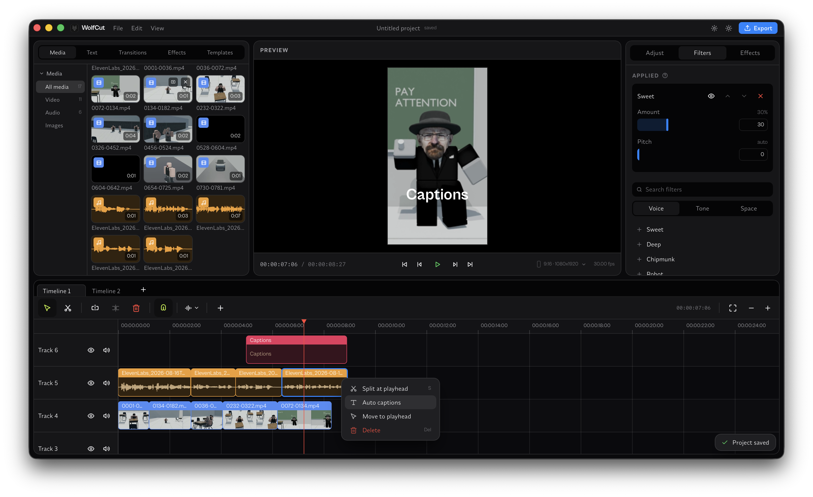

# WolfCut

**The free, open-source CapCut replacement.**

---

WolfCut is everything you use CapCut for — without the watermarks, paywalls,
or subscriptions. A native Rust engine does the heavy lifting, a clean React
interface does the editing, and it all runs on your machine: install it and
start cutting, no account, no extra downloads, no setup.

## Highlights

- 🎬 Multi-track timeline
- 🎙️ Free Voice Filters
- Free Local Auto-captions (transcription)
- Save and re-use Templates
- 🚫 No watermarks, ever.
- 🖥️ Cross-platform

## Get started

Currently in Alpha (pre-release), Download from [Releases](https://github.com/jub0t/WolfCut/releases), Supports:
- Windows (tested)
- MacOs (tested)
- Linux

## Growth

<a href="https://star-history.com/#jub0t/WolfCut&Date">
  <picture>
    <source media="(prefers-color-scheme: dark)" srcset="https://api.star-history.com/svg?repos=jub0t/WolfCut&type=Date&theme=dark" />
    <source media="(prefers-color-scheme: light)" srcset="https://api.star-history.com/svg?repos=jub0t/WolfCut&type=Date" />
    
  </picture>
</a>

WolfCut is under active development — things move fast and edges are sharp.

